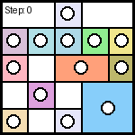
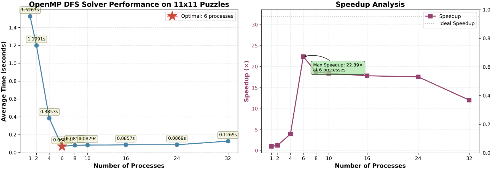

# Tentai Show Puzzle Generator & Solver

## Data Generation

Use the `generate_data.sh` script to generate puzzle instances.

### Usage

```bash
./generate_data.sh <grid_size> <count>
```

- `<grid_size>`: The dimensions of the puzzle grid (e.g., `5x5`, `10x10`).
- `<count>`: The number of puzzles to generate.

### Example

To generate 10 puzzles of size 5x5:

```bash
./generate_data.sh 5x5 10
```

### Output Structure

The script creates a `data/` directory with the following structure:

```
data/
  └── <grid_size>/       # e.g., data/5x5/
      ├── 00.in          # Puzzle input (grid visualization)
      ├── 00.out         # Puzzle solution (Game ID string)
      ├── 01.in
      ├── 01.out
      └── ...
```

- `*.in`: Contains the visual representation of the puzzle grid.
- `*.out`: Contains the "Game ID" string which encodes the solution map.

## Solvers

### Sequential DFS Solver (`seq_solver_dfs.cpp`)

A sequential solver that uses depth-first search (DFS) with backtracking to solve the Tentai Show puzzle.

**Features:**
- Uses DFS with backtracking to explore possible solutions
- Employs Zobrist hashing to prune previously visited states
- In-place state modification for O(1) updates instead of O(grid size) copying
- Optimized for sequential execution

**Usage:**

```bash
./run_seq.sh <input_file>
```

### OpenMP DFS Solver (`openmp_solver_dfs.cpp`)

A parallelized version of the DFS solver using OpenMP for improved performance on multi-core systems.

**Features:**
- Parallel DFS search using OpenMP task-based parallelism
- Shared Zobrist hash table with atomic operations for thread safety
- Dynamic work distribution across threads
- Early termination when a solution is found

**Usage:**

```bash
./run_openmp_cpp_dfs.sh <input_file>
```

## Visualization

The project includes visualization tools to animate the solving process. Solutions are generated as GIF animations showing step-by-step how the solver fills the puzzle grid.

### Example Visualization



The visualization shows the DFS solving process, with each frame representing a step in the search algorithm.

**Generate visualizations:**

```bash
./run_video_generator_dfs.sh <input_file>
```

## Experimental Results

